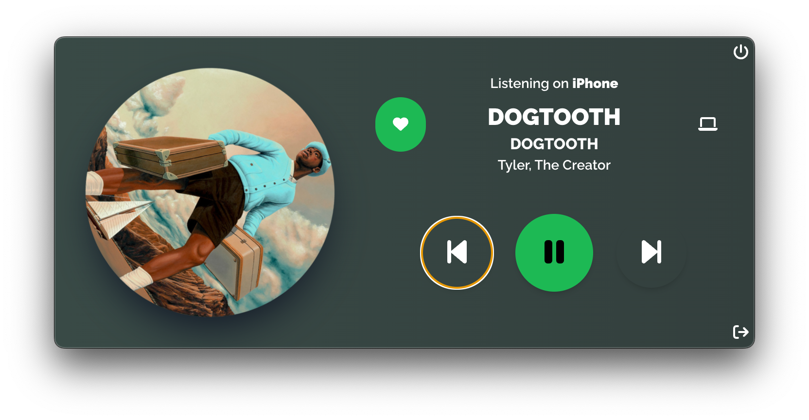

<p>
  
</p>

# **Spotbar**

Spotbar is a cute little widget-app that runs in the macOS menu bar - Windows/Linux support may be present, but I haven't had a chance to test it out yet and I'm not fully focusing on the code that is necessary to make the app working correctly on those OSes - that offers:
- Media controls: Previous track, Play/Pause, Next track, Add/Remove to your library;
- Album art displayed like a spinning disk,
- Track informations, such as Title, Artists, Album name;
- Info about which device it is currently playing through Spotify (since Spotify has a Connect feature that lets you choose the device on which you'd like to stream music).

Spotbar will soon have the ability to interact with Spotify Connect, so you'll be able to send audio streaming to other available devices directly in the widget.

The idea behind all this is not having to open the Spotify app for such basic actions, and control music playback coming from other devices directly in the menu bar. I love tray application because they help me doing specific things very quickly. 

Since I'm pretty obsessed with UI design, I'm trying to make Spotbar as clean and minimal as possible, while also providing some nice animations. I'm even thinking about adding a spectrum analyzer in the background for no particular reason other than aesthetics!

<p>
  
</p>

## Getting Started

The app requires `node.js`. Make sure to have it installed before proceeding, by typing `node --version` in your terminal. Install it on your machine if you don't have it by visiting [the official website](https://nodejs.org/it/download/), or by using the `brew` package manager for macOS.

The node package manager `npm` is also required. If you grabbed the installer from the node website then it should be already present in your system. Make sure it's installed by typing `npm --version`. Installing it should be pretty straight-forward.

## Installing

Before starting, install `yarn` with the command `(sudo) npm install --global yarn`. This app is written in TypeScript, so the `tsc` compiler is required before starting up. Type `tsc` in the command line to find out if you already have it install. If you don't, install it through `npm` by typing `(sudo) npm install --global typscript`.

You are officially ready! Clone this repo and install the required modules:

```
git clone https://github.com/levarr/Spotbar
cd Spotbar
yarn install
```

As of now, the backend and frontend parts have different `package.json` files, and it is necessary to cd in each of them in order to install their dependencies:

```
cd backend && yarn install && cd ..
cd frontend && yarn install && cd ..
```

You should now be back in the root directory. In here, run `yarn dev` to run the app. But **NOT** before you read the rest of this file!

## Spotify API

This app relies on Spotify API. Rather than building my own library to interact with them, Spotbar relies on an amazing open source library named [`spotify-web-api-node`](https://github.com/thelinmichael/spotify-web-api-node) offered by [Michael Thelin aka. @thelinmicheael](https://github.com/thelinmichael).

Currently, in order to use Spotbar, you have to create your personal *client_id* and *client_secret* by logging into the [Spotify Developer Dashboard](https://developer.spotify.com/dashboard/). Once you have them, you can setup your `.env` file in the root directory using the reference `.env.example` file provided. After that, you should be good to go. This can (and I'm pretty sure it will) change pretty soon, i.e. as soon as Spotbar reaches a form that I consider complete.

## Built With

* [Electron.js](https://www.electronjs.org/) - Backend (i.e. App window + IPC Handler for Spotify API calls made @ the frontend)
* [React.js](https://reactjs.org/) - Frontend
* [TailwindCSS](https://tailwindcss.com/) - CSS utility framework, together with PostCSS

## Contributing

*Work in progress!*

## Authors

* **Fabio Colonna** - *Initial work* - [levarr](https://github.com/levarr)

I look forward to adding somone else in here, in the future!

## License

*Work in progress!*
