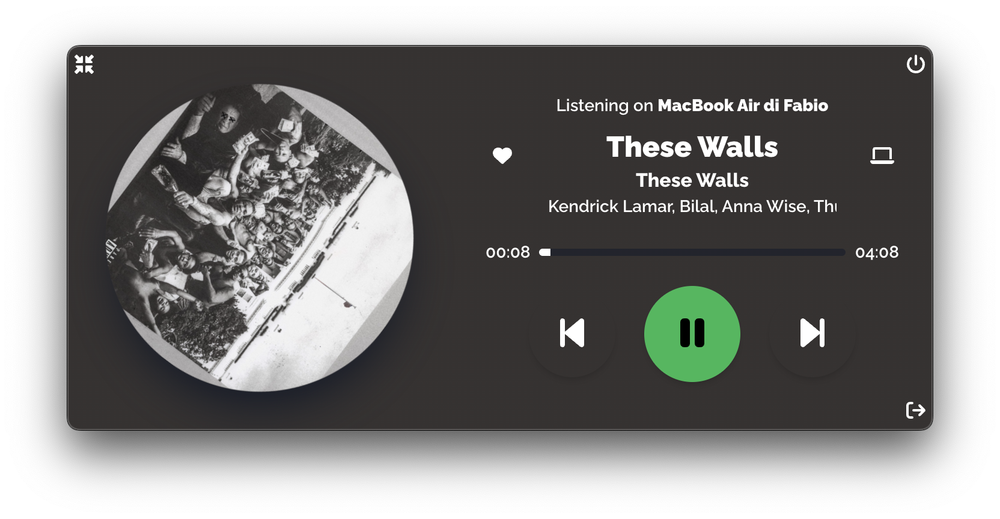

<p>

</p>

# **Spotbar**

Spotbar is a cute little widget-app that runs in your macOS/Windows/Linux menu bar, that offers

- Media controls: Previous track, Play/Pause, Next track, Add/Remove to your library;
- Album art displayed like a spinning disk, or a more compact version that hides it for a more minimal look;
- Track information, such as Title, Artists, Album name, Duration and Progress time;
- Info about which device it is currently playing (since Spotify has a Connect feature that lets you choose the device on which you'd like to stream music);
- Ability to interact with Spotify Connect: you're able to send audio stream to other available devices directly in the widget, and control their relative volume

The idea behind all this is not having to open the Spotify app for such basic actions, and control music playback coming from other devices directly in the menu bar. I love tray applications in general, because their main goal is to make certain common actions very quickly accessible.

<p>

</p>

## Getting Started

The app requires `node.js`. Make sure to have it installed before proceeding, by typing `node --version` in your terminal. Install it on your machine if you don't have it by visiting [the official website](https://nodejs.org/it/download/), or by using your favorite package manager (i.e. `brew` on macOS, `choco / winget` on Windows, `apt / dnf / pacman` on Linux). This procedure should automatically install the node's package manager `npm`. Make sure you have it by typing `npm --version`.

## Spotify API

This app relies on Spotify API. Rather than building my own library to interact with them, Spotbar relies on an amazing open source library named [`spotify-web-api-node`](https://github.com/thelinmichael/spotify-web-api-node) offered by [Michael Thelin aka. @thelinmicheael](https://github.com/thelinmichael).

Currently, in order to use Spotbar, you have to create your personal _client_id_ and _client_secret_ by creating an app into the [Spotify Developer Dashboard](https://developer.spotify.com/dashboard/). Spotbar will ask those info as soon as it starts, and it'll memorize them.

## Installing

This app is written in TypeScript, so the `tsc` compiler is required; type `tsc` in the command line to find out if you already have it installed. If you don't, install it through `npm` by typing `(sudo) npm install --global typscript`.

Ok, you're now ready: clone this repo and install the required modules:

```
git clone https://github.com/levarr/Spotbar
cd Spotbar
npm install
```

Once the operation is complete, you can:

- Start the application in development mode with the following command: `npm run dev`;
- Build the application for your specific OS using `npm run build:{win,mac,linux}`.

NB: Extensive documentation on the build commands won't be available until I actually try those on different machines with the various OSes. If you wanna use them right now and errors pop up, you'll need to sort them out yourself. I have to fully understand the _notarize_ process involved in Mac building yet.

## Built With

- [Electron.js](https://www.electronjs.org/)
- [React.js](https://reactjs.org/) with Redux Toolkit & Framer Motion
- [ViteJS](https://vitejs.dev)
- [TailwindCSS](https://tailwindcss.com/)

## Contributing

_Work in progress!_

## Authors

- **Fabio Colonna** - [levarr](https://github.com/levarr)

## License

Spotbar is under the MIT License.
